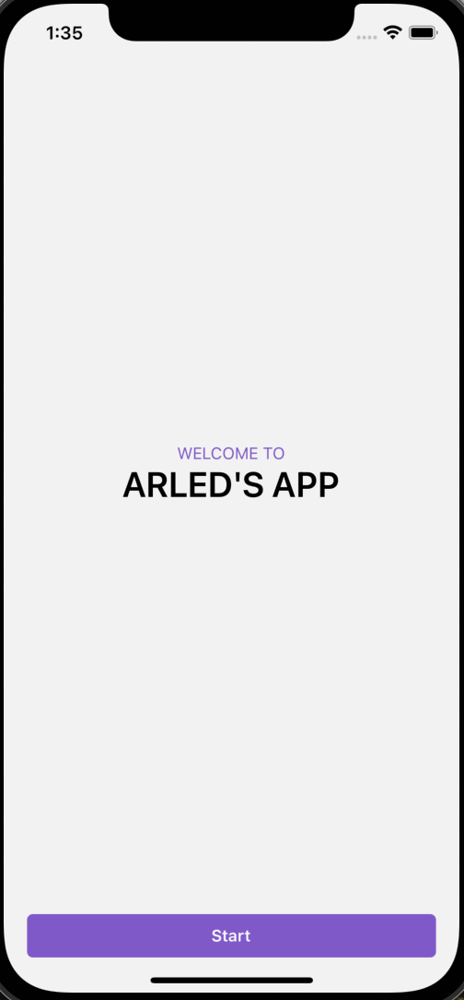

### Run project

## Build app

> `yarn clean-install`  
>
> If that doesn't work run: `yarn && npx pod-install`

## Run iOS app

> `yarn ios`

## Run Android app

> `yarn android`

## App screenshots

    

        
        
Home screen

    

    

        
        
Products screen

    

    

        
        
Cart screen

    

