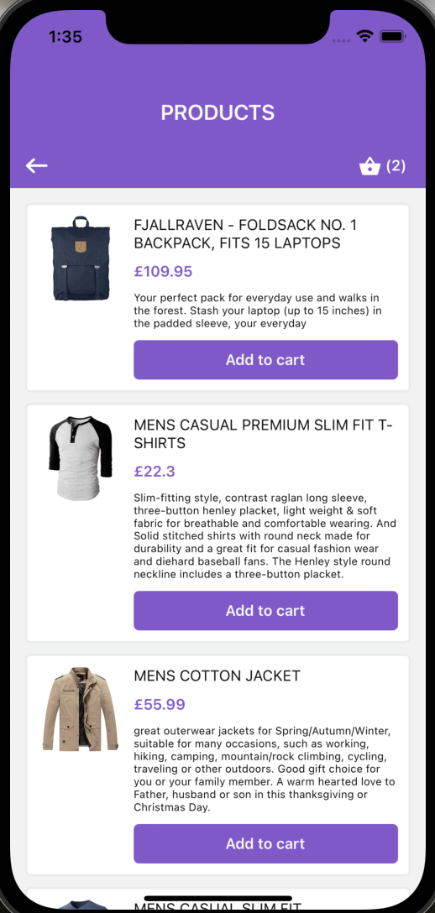

### Run project

## Build app

> `yarn clean-install`  
>
> If that doesn't work run: `yarn && npx pod-install`

## Run iOS app

> `yarn ios`

## Run Android app

> `yarn android`

## App screenshots

| Home screen                                                        | Products screen                                                                          | Cart screen                                                       |
| ------------------------------------------------------------------ | ---------------------------------------------------------------------------------------- | ----------------------------------------------------------------- |
|  |  |  |
